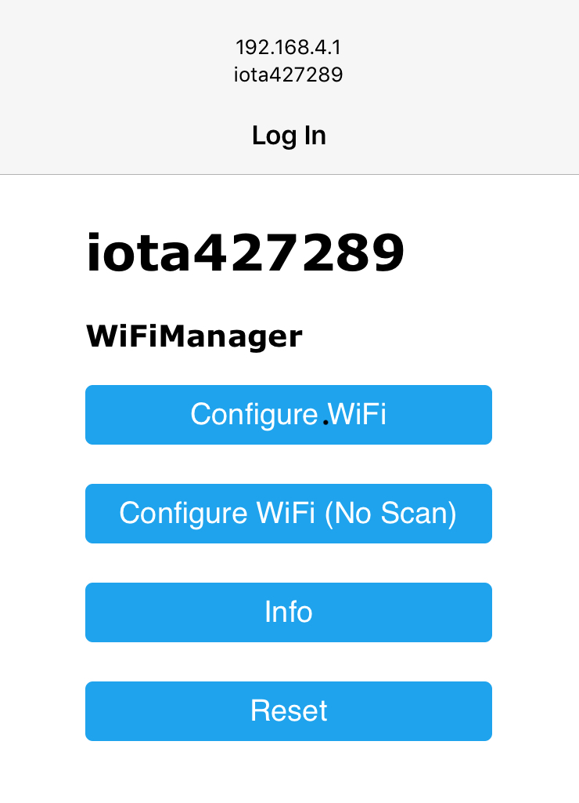
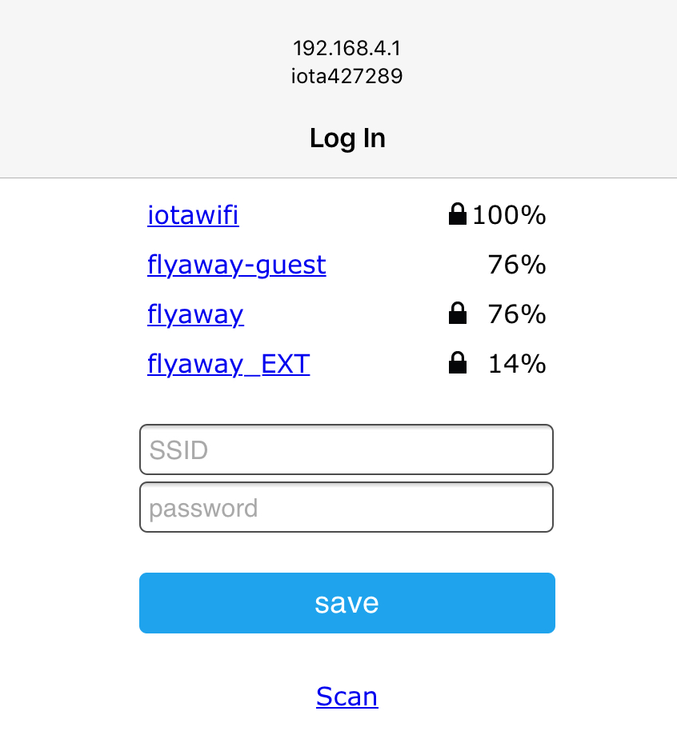
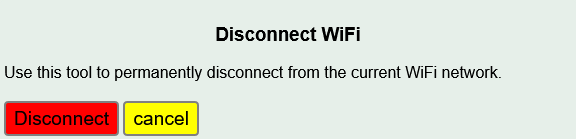

==================
Connecting to WiFi
==================

Purpose
-------

When Maclogger powers up, it attempts to connect to the 
last WiFi network used.
A connection must be established to an internet connected network if the real
time clock is not set, or to run the configuration utility,
or if logging to an external server like Emoncms is desired.
*It is strongly recommended to connect the Maclogger to a WiFi network
with a reliable internet connection*.

If the power-up connection is successful, 
the LED will begin to glow dull green.
This indicates that the Maclogger has connected 
and is in normal operating mode.
At this point you can skip ahead to the next 
section `Device Configuration <devConfig.html>`__

New connection
--------------

If the Maclogger has never been connected to a WiFi network (new),
or the last used network is not available, the ESP8266 will enter
AP (Access Point) mode when powered-up (not on a software restart).
This state is indicated when the LED flashes the 
three color sequence RED-GREEN-GREEN.
It will broadcast an SSID recognizable by the 
prefix ``Maclogger`` followed by a unique number.
Connect to it using a smartphone or tablet.  
Use the password ``Maclogger`` (case sensitive).
If the device was previously configured and the 
device name was changed,
that new name will be the password required in this step.

After connecting, a page will be rendered with several choices.  Select ``Configure WiFi``.

A few seconds may elapse while the Maclogger scans for the local networks,
then another page will be rendered allowing you to select one of the listed
networks, or specify another network not listed.

Note that the Maclogger only supports 2.4 GHz wireless networks. If you have a 5 GHz
only network you can either enable 2.4 GHz on it, or create a separate (optionally hidden)
network on 2.4 GHz for the Maclogger to use.

Select your network and enter the password, then save. Once connected,
the new WiFi network credentials will be saved and the device 
will continue it's
startup procedure.  If you see another LED sequence, refer to 
the `troubleshooting <troubleshooting.html>`__ section.

When the LED glows dull green, proceed to the next step
`Device Configuration  <devConfig.html>`__

Resetting WiFi to Defaults
--------------------------

If you wish to change the WiFi SSID that the Maclogger is connected to
(you might have done some testing and want to deploy 'live' somewhere where the SSID is different)
BEFORE moving the device you should reset the WiFi.

Using the configuration app go to ``Tools->WiFi``

After the command to disconnect the existing WiFi connection has been sent, 
Maclogger will respond "ok" and the LED will change from a dull green to a dull red as the Maclogger disconnects,
indicating that the WiFi link has been severed.

Then power cycle the Maclogger. It should restart with the RED-GREEN-GREEN led sequence like a new
Maclogger ready to connect to the new SSID
